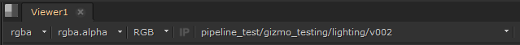

# Nuke

From Nuke you can publish various output formats. To publish an output format, you'll need to setup the scene first. Different output formats has different workflows for setting up the scene:

```eval_rst
==============  =======
Output Format   Section
==============  =======
Image Sequence  `Write Node <http://pyblish-bumpybox.readthedocs.io/en/latest/nuke.html#write-node>`_
Gizmo           `Group <http://pyblish-bumpybox.readthedocs.io/en/latest/nuke.html#group>`_
LUT             `Group <http://pyblish-bumpybox.readthedocs.io/en/latest/nuke.html#group>`_
==============  =======
```

## Write Node

To publish an image sequence from a write node, you just need to create one. The name of the write node will be the name of the output.

When you create a write node, some default settings and file path will be setup. By default the image format will be validated to EXR.

<iframe width="560" height="315" src="https://www.youtube.com/embed/NXydycPNzwk" frameborder="0" allowfullscreen></iframe>

If you want a different output format, you just need to input the extension and setup the formats settings.

<iframe width="560" height="315" src="https://www.youtube.com/embed/_qvu4VfbUC8" frameborder="0" allowfullscreen></iframe>

Disabling a write node will disable it for publishing. Similarly if you disable a write node instances in the UI, it will get disabled in the Nuke script.

## Group

To publish a gizmo, you'll need to setup a group. Please read about creating groups here: http://help.thefoundry.co.uk/nuke/8.0/content/user_guide/configuring_nuke/creating_sourcing_gizmos.html

To publish a LUT, you'll need to setup a group. Please read the ```To Create a Viewer Process Gizmo``` section here: http://help.thefoundry.co.uk/nuke/8.0/content/user_guide/configuring_nuke/using_gizmo_viewer_process.html

## Remote Rendering/Processing

To send the processing of a node to a farm or the cloud, you need to encapsulate the write nodes with a backdrop, that has a name starting with ```remote```. You can have multiple backdrops in the Nuke script.

<iframe width="560" height="315" src="https://www.youtube.com/embed/exfn1nCQTYI" frameborder="0" allowfullscreen></iframe>

You can also use the ```Processing Location``` tool to setup the write nodes. You'll the ```Processing Location``` tool under the ```pyblish-bumpybox``` menu.

You can read more about the supported remote processing solutions [here](http://pyblish-bumpybox.readthedocs.io/en/latest/remote.html)

## Workspace Loader

When you have processed a node, you can load the resulting work files into Nuke with the ```Workspace Loader```.   
You can find the ```Workspace Loader``` under the ```pyblish-bumpybox``` file menu.

## Ftrack

When launching Nuke from Ftrack there will be an initial setup of the script, depending on the custom attributes that are available. These custom attributes will be queried from the parent entity of the task.

```eval_rst
==========================  =================  ==========================
Description                 Ftrack Attributes  Nuke Project Settings Knob
==========================  =================  ==========================
First frame of frame range  fstart             first_frame
Last frame of frame range   fend               last_frame
Frame rate                  fps                fps
Resolution width            width              format
Resolution height           height             format
==========================  =================  ==========================
```

Once these settings are set, they will not be set again. You can force the settings to be applied on start up, by unchecking the attributes in the ```Ftrack``` tab of Project Settings.

### LUT

If a LUT is published to any of the launched tasks parents, ei. its shot, sequence or project, it will use the closest related LUT as a ViewerProcess in Nuke. You can see which LUT is being loaded in the Viewer controls:



### Scan for unused components

If you are launching a script that has assets already imported, the script will be checked if you are not using some components from the asset and prompt you to import them.
