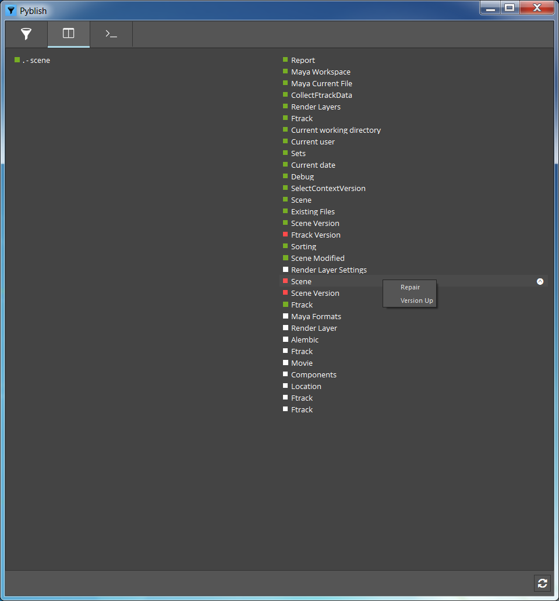

## Welcome to pyblish-bumpybox documentation.

### Installation

This package is dependent on:

- [pyblish-base](https://github.com/pyblish/pyblish-base)
- [pyblish-lite](https://github.com/pyblish/pyblish-lite)
- [pyblish-maya](https://github.com/pyblish/pyblish-maya)
- [pyblish-nuke](https://github.com/pyblish/pyblish-nuke)
- [pyblish-houdini](https://github.com/pyblish/pyblish-houdini)
- [pyblish-standalone](https://github.com/pyblish/pyblish-standalone)
- [clique](https://gitlab.com/4degrees/clique)
- [pyperclip](https://github.com/asweigart/pyperclip)

Please refer to the individual packages for installation.

You also need to setup the environment before launching any application:

```
PYTHONPATH = "[pyblish-bumpybox repository path];[pyblish-bumpybox repository path]/pyblish_bumpybox/environment_variables/pythonpath"
HIERO_PLUGIN_PATH = "[pyblish-bumpybox repository path]/pyblish_bumpybox/environment_variables/hiero_plugin_path"
NUKE_PATH = "[pyblish-bumpybox repository path]/pyblish_bumpybox/environment_variables/nuke_path"
HOUDINI_PATH = "[pyblish-bumpybox repository path]/pyblish_bumpybox/environment_variables/houdini_path"
```

The plugins needs to be added to ```PYBLISHPLUGINPATH``` before launching any application. They are categorized into ```[host]\[task]```, so depending on which application are you working, you need to modify ```PYBLISHPLUGINPATH```. For example for a modeling task in Maya ```PYBLISHPLUGINPATH``` would look like this;

```
PYBLISHPLUGINPATH = "[pyblish-bumpybox repository path]/pyblish_bumpybox/plugins;[pyblish-bumpybox repository path]/pyblish_bumpybox/plugins/maya;[pyblish-bumpybox repository path]/pyblish_bumpybox/plugins/maya/modeling"
```

### Workflow

#### Scene

Publishing a scene is the same workflow across all applications.

Once the application is open, go to ```File > Publish```, which will bring up the UI for publishing.


Hit the ```Publish``` button (play icon) and wait for Pyblish to finish working.



The scene path will be validated, and if its the first time publishing the validation will most likely fail as shown above. When this happens just right-click and choose ```Repair``` to fix the scene path. The repairing will process for a little while, and then turn the icon next to "Scene" green. If this doesn't happen or the icon turns red, please contact your pipeline person.

Finally you hit ```Reset``` (refresh icon) and try to publish again. Once all the checkboxes have turned green, you will have done a successful publish.

#### Output

The workflow for outputting from each application is slighly different, but generally follow "Try'n'Repair".

Each supported application is listed below;

- [Houdini](houdini.md)
- [Maya](maya.md)

### Reporting

If anything goes wrong with a publish you can copy a report and send it or post it on the issues page; https://github.com/Bumpybox/pyblish-bumpybox/issues

To copy the report right-click on the ```Report``` plugin, and select ```Copy To Clipboard```.


```eval_rst
.. toctree::
   :maxdepth: 2
   :hidden:

   instances
   houdini
   maya
```
